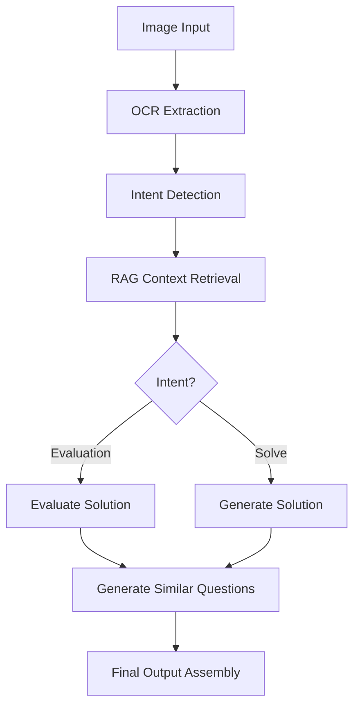

# 🎓 Educational AI Tutor System

An end-to-end **agentic RAG educational AI tutor system** for Class 5 math students using LangChain, LangGraph, and Gemini Pro 1.5.

## 🌟 Features

- **🖼️ Image-to-Text OCR**: Convert handwritten or printed math problems to text using Gemini Pro 1.5 Vision
- **🤖 Intent Detection**: Automatically detect if student wants evaluation or solution
- **📚 Knowledge Base (RAG)**: Uses Class 5 math PDF with intelligent context retrieval
- **⚡ Agentic Workflow**: Powered by LangGraph for complex state transitions
- **📊 Comprehensive Evaluation**: Scoring, feedback, and improvement suggestions
- **🔄 Step-by-Step Solutions**: Clear explanations suitable for 10-year-olds
- **❓ Similar Questions**: Generate practice questions automatically

## 🎯 System Workflow



## 📦 Installation

### Prerequisites
- Python 3.8+
- Google API key for Gemini Pro 1.5

### Quick Setup (Windows)
1. **Clone/Download** the project
2. **Run setup script**:
   ```bash
   setup_env.bat
   ```

### Manual Setup
1. **Create virtual environment**:
   ```bash
   python -m venv venv
   venv\Scripts\activate  # Windows
   ```

2. **Install dependencies**:
   ```bash
   pip install --upgrade pip
   pip install -r requirements.txt
   ```

3. **Configure environment**:
   - Copy `.env` file and add your Google API key:
   ```
   GOOGLE_API_KEY=your_gemini_api_key_here
   ```

## 🚀 Usage

### Command Line Interface

#### Process a Math Problem
```bash
python main.py --image "path/to/math_problem.jpg" --prompt "Check my answer"
```

#### Setup Knowledge Base
```bash
python main.py --setup-kb --pdf "data/class5_math_book.pdf"
```

#### Validate System
```bash
python main.py --validate
```

#### Interactive Mode
```bash
python main.py
```

### Python API

```python
from main import EducationalTutorSystem

# Initialize system
tutor = EducationalTutorSystem(
    api_key="your_api_key",
    pdf_path="data/class5_math_book.pdf"
)

# Process a math problem
result = tutor.process_math_problem(
    image_path="path/to/problem.jpg",
    student_prompt="Please check my solution"
)

print(result)
```

## 📊 Expected Output Format

```json
{
  "intent": "evaluation",
  "score": 8,
  "is_correct": true,
  "correct_answer": "42",
  "explanation": "Great work! You correctly solved 25 + 17 = 42. Your method is perfect.",
  "similar_questions": [
    "What is 23 + 19?",
    "Calculate 28 + 15",
    "Find the sum of 31 + 16"
  ]
}
```

## 🏗️ Project Structure

```
education_project/
├── main.py                    # Main entry point
├── langgraph_agent.py        # LangGraph workflow orchestration
├── ocr_utils.py             # Image-to-text extraction
├── intent_utils.py          # Intent detection logic
├── evaluation_utils.py      # Solution evaluation
├── solve_utils.py           # Step-by-step problem solving
├── similar_question_utils.py # Similar question generation
├── rag_utils.py             # RAG system and vector store
├── prompts.py               # Prompt templates
├── requirements.txt         # Dependencies
├── .env                     # Environment variables
├── setup_env.bat           # Windows setup script
├── data/                   # PDF storage
│   └── class5_math_book.pdf
└── vectorstore/            # FAISS index storage
    └── faiss_index/
```

## 🔧 Key Components

### 1. **OCR Extraction** (`ocr_utils.py`)
- Uses Gemini Pro 1.5 Vision for accurate text extraction
- Handles handwritten and printed math problems
- Validates image formats and quality

### 2. **Intent Detection** (`intent_utils.py`)
- Determines if student wants evaluation or solution
- Separates problem statement from student work
- Uses contextual analysis for accurate classification

### 3. **RAG System** (`rag_utils.py`)
- Loads Class 5 math PDFs with metadata (subject, class, chapter)
- Chunks using RecursiveCharacterTextSplitter
- FAISS vector store with MMR retrieval
- GoogleGenerativeAIEmbeddings for semantic search

### 4. **Evaluation Engine** (`evaluation_utils.py`)
- Comprehensive 0-10 scoring system
- Detailed feedback and error analysis
- Constructive suggestions for improvement
- Format validation and presentation scoring

### 5. **Solution Generator** (`solve_utils.py`)
- Step-by-step explanations for 10-year-olds
- Multiple solution methods when applicable
- Learning objectives and difficulty assessment
- Clear mathematical notation

### 6. **Question Generator** (`similar_question_utils.py`)
- Context-aware similar questions
- Progressive difficulty levels
- Themed questions for engagement
- Comprehensive question sets

### 7. **LangGraph Agent** (`langgraph_agent.py`)
- State-based workflow orchestration
- Error handling and recovery
- Memory management
- Conditional routing logic

## 🎨 Customization

### Adding New Subjects
1. Update metadata in `rag_utils.py`
2. Modify prompts in `prompts.py`
3. Adjust evaluation criteria in `evaluation_utils.py`

### Changing Difficulty Levels
1. Update prompts for target grade level
2. Modify scoring rubrics
3. Adjust similar question complexity

### Custom Themes
1. Add themes in `similar_question_utils.py`
2. Update themed question generation
3. Customize for local context

## 🧪 Testing

### System Validation
```bash
python main.py --validate
```

### Component Testing
```python
# Test OCR
from ocr_utils import extract_text_from_image
text = extract_text_from_image("test_image.jpg")

# Test Intent Detection
from intent_utils import detect_intent
intent = detect_intent(text, "Check my answer")

# Test Evaluation
from evaluation_utils import evaluate_solution
result = evaluate_solution("2+2=?", "2+2=4")
```

## 📋 Requirements

- **Core**: `langchain==0.1.0`, `langgraph==0.0.20`
- **AI**: `google-generativeai==0.3.2`, `langchain-google-genai==0.0.8`
- **Vector Store**: `faiss-cpu==1.7.4`, `chromadb==0.4.18`
- **Document Processing**: `pdfplumber==0.9.0`, `pypdf==3.17.4`
- **Utils**: `python-dotenv==1.0.0`, `pillow==10.1.0`

## 🔑 API Key Setup

1. **Get Gemini API Key**:
   - Visit [Google AI Studio](https://makersuite.google.com/app/apikey)
   - Create a new API key
   - Copy the key

2. **Configure Environment**:
   ```bash
   # Option 1: .env file
   echo "GOOGLE_API_KEY=your_key_here" > .env
   
   # Option 2: Environment variable (Windows)
   set GOOGLE_API_KEY=your_key_here
   
   # Option 3: Pass directly to system
   python main.py --api-key your_key_here
   ```

## 🚨 Troubleshooting

### Common Issues

1. **"Google API key not provided"**
   - Check `.env` file exists and contains valid key
   - Verify environment variable is set
   - Try passing key directly with `--api-key`

2. **"Vector store not found"**
   - Run knowledge base setup: `python main.py --setup-kb --pdf path/to/pdf`
   - Check PDF file exists and is readable

3. **"OCR extraction failed"**
   - Verify image file exists and is supported format
   - Check image is clear and readable
   - Try different image formats (JPG, PNG, etc.)

4. **Import errors**
   - Ensure virtual environment is activated
   - Re-run `pip install -r requirements.txt`
   - Check Python version (3.8+ required)

### Performance Tips

1. **Large PDFs**: Chunk size and overlap can be adjusted in `rag_utils.py`
2. **Image Quality**: Higher resolution images give better OCR results
3. **Context Retrieval**: Adjust `k` parameter for more/fewer context chunks

## 🤝 Contributing

1. Fork the repository
2. Create feature branch
3. Test thoroughly
4. Submit pull request

## 📄 License

MIT License - see LICENSE file for details

## 🙋‍♂️ Support

For issues and questions:
1. Check troubleshooting section
2. Run system validation
3. Create GitHub issue with logs

---

**Happy Learning! 🎓✨**
